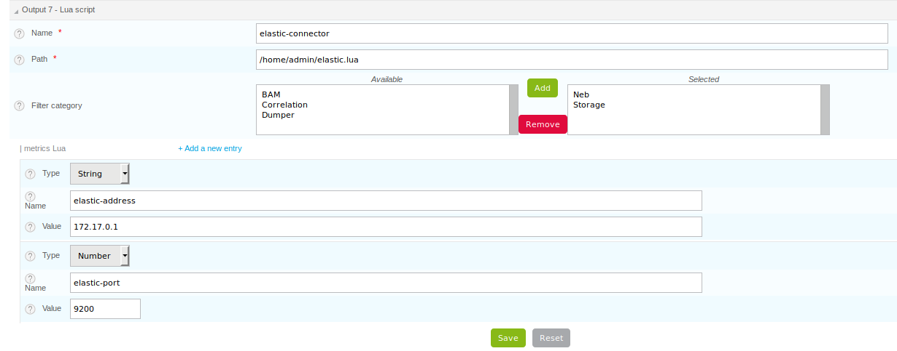

.. _exploit_stream_connector:

#################
Stream connectors
#################

Centreon Broker provides a stream connector. If no suitable connector is
found among those provided then surely this stream connector will match your
needs. Its principle is to expose a part of Centreon Broker API
through the Lua interpreter and the user has just to fill it with his needs.

The exposed Centreon Broker
===========================

Here is the minimal acceptable Lua code to work as stream connector:

.. code-block:: lua

  function init(conf)
  end

  function write(d)
    return true
  end

We recommand to put Lua scripts in the ``/usr/share/centreon-broker/lua``
directory. If it does not exist, we can create it. Just be careful that
directory to be accesible for the centreon-broker user. If a stream connector
is composed of several files (a main script and a module for example), you can
put them in that directory. If a dynamic library (``\*.so`` file) is used by
a Lua script, put it in the ``/usr/share/centreon-broker/lua/lib`` directory.

When Centreon Broker starts, it initializes all the configured connectors.
For the stream connector, it loads the Lua script, checks its syntax and
verifies that the ``init()`` and ``write()`` functions exist.

Centreon Broker checks also if a function ``filter(category, element)`` exists.

Let's focus on those functions. ``init`` function is called when the
connector is initialized. The argument provided to this function is a Lua
table containing information given by the user in the Centreon web output broker
configuration interface. For example, if an IP address is provided with the
name *address* and the value *192.168.1.18*, then this information will be
accessible through ``conf["address"]``.

The ``write()`` function is called each time an event is received from a poller
through the broker. This event is configured to be sent to this connector.
This function needs one argument which is the event translated as a Lua table.

The ``write()`` must return a boolean that is true if the events are processed
and false otherwise.

If this function does not return a boolean, Broker will rise an error.

The Broker Lua SDK
==================

To simplify Lua developer's life, several objects are proposed and
directly available to the script.

The *broker_log* object
-----------------------

1. ``broker_log:set_parameters(level, filename)`` allows the user to set
   a log level and a file name. The level is an integer from 1 to 3, from the
   more important to the less one. The file name must contain the full path.
   And the file must be accessible to centreon-broker. If this method is not
   called, then logs will be written in the centreon broker logs.
2. ``broker_log:info(level, content)`` writes a log *information* if the
   given level is less or equal to the one configured. The content is the
   text to write in the logs.
3. ``broker_log:warning(level, content)`` works like ``log_info`` but
   writes a *warning*.
4. ``broker_log:error(level, content)`` works like ``log_info`` but writes an
   *error*.

Here is an example:

.. code-block:: lua

  function init(conf)
    -- Here, we allow all logs with level 3 and set the output to
    -- /tmp/test.log.
    broker_log:set_parameters(3, "/tmp/test.log")
  end

  function write(d)
    -- For each entry, we write the key and the value.
    for k,v in pairs(d) do
      broker_log:info(3, k .. " => " .. tostring(v))
    end
    return true
  end

Here, when the ``init`` function is executed, the *broker_log* object is
parametrized with a max level 3 and an output file */tmp/test.log*.

Then on each ``write()`` call, events received are logged as
info. We get a result like this:

::

  Fri Jan 26 08:31:49 2018: INFO: service_id => 21
  Fri Jan 26 08:31:49 2018: INFO: type => 0
  Fri Jan 26 08:31:49 2018: INFO: host_id => 13
  Fri Jan 26 08:31:49 2018: INFO: element => 1
  Fri Jan 26 08:31:49 2018: INFO: comment_data =>

**Note** - To use a method in Lua, the separator between the object and the
method is ``:`` ; *broker_log* is an object since it contains informations
such as the max level or the destination file.

The TCP broker socket
---------------------

A basic TCP socket is available in the *Broker* SDK. A simple example is the
following:

.. code-block:: lua

  local socket = broker_tcp_socket.new()
  socket:connect("10.40.1.2", 9002)
  socket:write(message)
  answer = socket:read()
  socket:close()

1. In this example, the first call is *broker_tcp_socket.new()*. It creates a
   new socket by calling the function *new()* stored in the table
   *broker_tcp_socket*.
2. The next step is a call to the *connect* method that needs two arguments:
   a string given an ip or a host name to connect to and the port to use.
3. The next step is a call to the *write* method that writes a string into
   the socket. The method call is finished when the entire message is sent.
4. The *read* method gets a string as result.
5. When the user finishes using the socket, he can close the socket with the
   *close()* method.

This socket object also provides a method *get_state()* that returns a string:

1. *unconnected*: the socket is not connected
2. *hostLookup*: the socket is performing a host name lookup
3. *connecting*: the socket has started establishing a connection
4. *connected*: a connection is established
5. *closing*: the socket is about to close (data may still be waiting to be
   written).

The *broker* table
------------------

Several functions are available in this table. These functions are not
methods, *broker* is just a table containing them. We can find here:

1. ``json_encode(object)`` that converts into json a Lua object. The json is
   returned as string by the function.
2. ``json_decode(json)`` that converts into Lua object a json string. The object
   is directly returned by the method.
3. ``parse_perfdata(str)`` that takes as argument a string containing perfdata.
   A second boolean argument is available. If it is *true*, the returned table
   is larger and gives all the details on the metrics as well as the *warning*
   and *critical* thresholds. On success it returns a table containing the
   values retrieved from the perfdata. On failure it returns a nil object
   and an error description string.

.. code-block:: lua

  local obj = {
    a = 1,
    b = 2,
    c = { 'aa', 'bb', 'cc' }
  }
  local json = broker.json_encode(obj)
  print(json)

that returns

::

  { "a": 1, "b": 2, "c": [ 'aa', 'bb', 'cc' ] }

A second example is the following:

.. code-block:: lua

  local json = { "a": 1, "b": 2, "c": [ 'aa', 'bb', 'cc' ] }
  local obj = broker.json_decode(json)

  for i,v in pairs(obj) do
    print(i .. " => " .. tostring(v))
  end

should return something like this:

::

  a => 1
  b => 2
  c => table: 0x12ef67b5

It is also easy to access to each field of the object, for example:
``obj['a']`` gives 1, or ``obj['c'][1]`` gives *aa*, or ``obj.b`` gives 2.

Here is an example showing the possibilities of the ``parse_perfdata`` function.

.. code-block:: lua

  local perf, err_str = broker.parse_perfdata(" 'one value'=2s;3;5;0;9 'a b c'=3.14KB;0.8;1;0;10")

  if perf then
    for i,v in pairs(perf) do
      print(i .. " => " .. tostring(v))
    end
  else
    print("parse_perfdata error: " .. err_str)
  end

should return something like this:

::

  a b c => 3.14
  one value => 2

If now, we call the same function with *true* as second argument:

.. code-block:: lua

  local perf, err_str = broker.parse_perfdata("pl=45%;40;80;0;100", true)

  if perf then
    print("Content of 'pl'")
    for i,v in pairs(perf['pl']) do
      print(i .. " => " .. tostring(v))
    end
  else
    print("parse_perfdata error: " .. err_str)
  end

should return something like this:

::

  Content of 'pl'
  value => 45
  uom => %
  min => 0
  max => 100
  warning_low => 0
  warning_high => 40
  warning_mode => false
  critical_low => 0
  critical_high => 80
  critical_mode => false

Be careful, keys are not sorted in hash tables, so if you make a such program, you will probably not
have data in the same order.

The *broker_cache* object
-------------------------

This object provides several methods to access the cache. Among data, we can
get hostnames, etc...

**Note** - The functions described here need the cache to be filled. It is
important for that to enable the NEB events, otherwise those functions will
just return ``nil``. **The cache is filled when an engine restarts**.

The available methods are:

1.  ``get_ba(ba_id)`` that gets *ba* informations from its id. This function
    returns a table if found or *nil* otherwise.
2.  ``get_bv(bv_id)`` that gets *bv* informations from its id. This function
    returns a table if found or *nil* otherwise.
3.  ``get_bvs(ba_id)`` that gets all the *bv* containing the *ba* of id *ba_id*.
    This function returns an array of *bv* *ids*, potentially empty if no *bv*
    are found.
4.  ``get_hostgroup_name(id)`` that gets from the cache the host group name of
    the given id. This function returns a string or *nil* otherwise.
5.  ``get_hostgroups(host_id)`` that gets the list of host groups containing the
    host corresponding to *host_id*. The return value is an array of objects,
    each one containing two fields, *group_id* and *group_name*.
6.  ``get_hostname(id)`` that gets from the cache the host name corresponding to
    the given host id. This function returns a string with the host name or
    *nil* otherwise.
7.  ``get_index_mapping(index_id)`` that gets from the cache the
    index mapping object of the given index id. The result is a table containing
    three keys, ``index_id``, ``host_id`` and ``service_id``.
8.  ``get_instance_name(instance_id)`` that gets from the cache the
    instance name corresponding to the instance id.
9.  ``get_metric_mapping(metric_id)`` that gets from the cache the
    metric mapping object of the given metric id. The result is a table
    containing two keys, ``metric_id`` and ``index_id``.
10. ``get_service_description(host_id,service_id)`` that gets from the cache the
    service description of the given pair host_id / service_id. This function
    returns a string or *nil* otherwise.
11. ``get_servicegroup_name(id)`` that gets from the cache the service group name*
    of the given id. This function returns a string or *nil* otherwise.
12. ``get_servicegroups(host_id, service_id)`` that gets the list of service
    groups containing the service corresponding to the pair *host_id* /
    *service_id*. The return value is an array of objects, each one containing
    two fields, *group_id* and *group_name*.

The init() function
===================

This function must **not** be defined as ``local``, otherwise it will not be
detected by centreon broker.

Imagine we have made such configuration:

with two custom entries:

1. a string *elastic-address* with ``172.17.0.1`` as content.
2. a number *elastic-port* with 9200 as content.

Then, the ``init()`` function has access to them like this:

.. code-block:: lua

  function init(conf)
    local my_address = conf['elastic-address']
    local port = conf['elastic-port']
  end

The write() function
====================

This function must **not** be defined as ``local``, otherwise it will not be
seen by broker.

The only argument given to the ``write()`` function is an event. It is given
with the same data as the ones we can see in Centreon Broker.

To classify the event, we have two data that are ``category`` and ``element``.
Those two informations are integers. If we concatenate those two numbers
we obtain a longer integer equal to the event ``type`` also available in the
event as ``_type``.

+-----------+--------------+-----------+
| **int**   |  **short**   | **short** |
+-----------+--------------+-----------+
|_type =    | category     | elem      |
+-----------+--------------+-----------+

Sometimes, one can want the hostname corresponding to an event but he only gets
the ``host_id``. It is possible to get it thanks to the
``broker_cache:get_hostname(id)`` method.

For example:

.. code-block:: lua

  function write(d)
    if d.category == 3 and d.element == 1 then
      local hostname = broker_cache:get_hostname(d.host_id)
      if hostname then
        broker_log:info("host name "
            .. hostname .. " corresponds to host id " .. d.host_id)
      else
        -- Unable to get the name, we wait for the next time, wishing
        -- the cache will contain the name. And so return 0
        return true
      end
    end
    -- Here, we can add the event processing...

    return true
  end

The ``write`` function return value is a boolean. While this value is *false*,
Broker keeps the sent events in memory and if needed in retention. When we
are sure all events are processed, the idea is that ``write`` returns *true*
and then Broker frees the events stack.

Behind this, it is possible to avoid to commit events one by one.
The ``write`` function can stock them in a stack and return *false*, and when
a given limit is reached, it can send all of them to their destination and
return *true*.

The filter() function
=====================

The function must **not** be defined as ``local``, otherwise it will not be
detected by Centreon Broker.

It takes account of two parameters: ``category`` and ``element`` that we've
already seen in the previous section. The category is an integer from 1 to 7,
or the value 65535. The ``element`` gives details on the event, for example,
for the *category NEB*, *elements* are *Acknowledgement*, *Comment*, etc...
given as integers.

For details on types, categories and their id, see
https://documentation.centreon.com/docs/centreon-broker/en/latest/dev/bbdo.html
